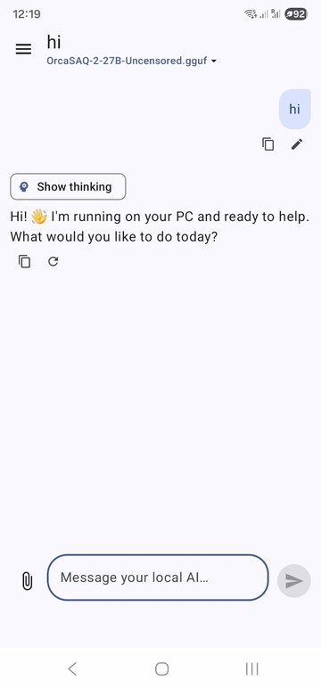
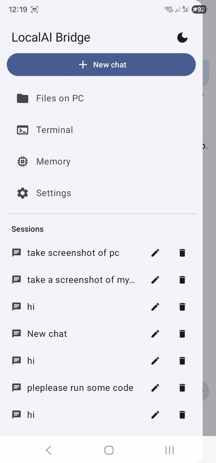
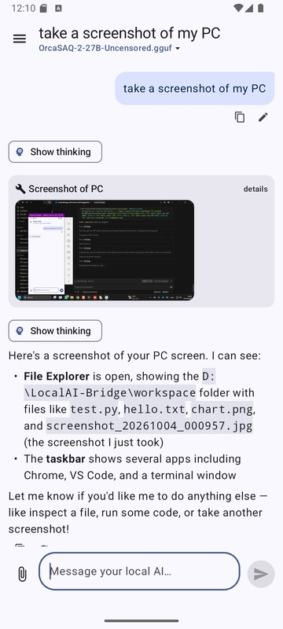
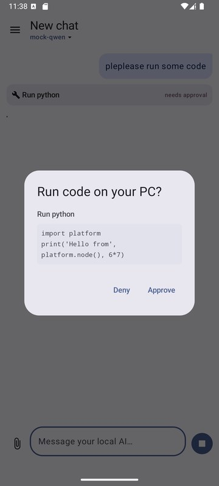
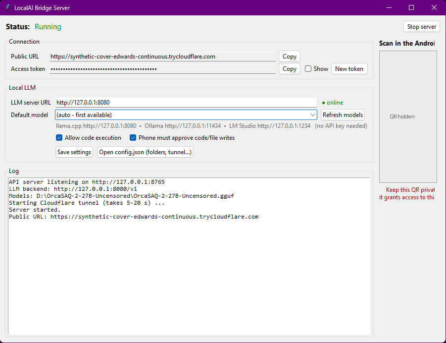

# LocalAI Bridge

**Use the AI model running on your Windows PC from your Android phone, from anywhere.**

LocalAI Bridge connects an Android app to a local LLM (llama.cpp, Ollama, LM Studio...) through an
encrypted Cloudflare tunnel. No port forwarding and no cloud AI: your model, your PC, your data.
The assistant can **run code on the PC, browse and read your folders, read PDFs and images, take
screenshots, draw charts, and remember things across chats**.

<p align="center">
  
  
  
  
</p>
<p align="center"></p>

```
Android app ──HTTPS──► Cloudflare tunnel ──► LocalAI Bridge server (127.0.0.1:8765) ──► llama.cpp / Ollama / LM Studio
                                                    │
                                                    ├─ chat sessions + long-term memory (SQLite)
                                                    ├─ tools: run code, files, screenshots, charts, memory
                                                    └─ uploads: PDF text extraction, images for vision models
```

---

## Features

| | |
|---|---|
| 💬 **Chat** | Streaming replies, multiple sessions (rename / delete), pick any loaded model, show the model's "thinking" |
| ✏️ **Messages** | Copy any message, edit a sent message (the chat continues from there), regenerate the last answer |
| 🖥️ **Run code on the PC** | Python, PowerShell or cmd, by the AI or by you from the Terminal screen. Approval on the phone first |
| 📁 **Files on PC** | Browse allowed folders, open/share files, upload from phone to PC, "Ask AI about this file" |
| 🖼️ **Images** | Attach photos/images/PDFs/camera shots, screenshot your PC, charts the AI draws appear inline. Tap to zoom, share or save |
| 🧠 **Memory** | The AI saves facts about you that carry across all chats. View, add or delete them in the app |
| 🌗 **Themes** | Light, dark or follow the system |
| 🔒 **Security** | 256-bit token, HTTPS tunnel, server only listens on localhost, approval for code and file writes |

---

## How to run it

### What you need

- **Windows 10/11 PC** with **Python 3.10+** ([python.org](https://www.python.org/downloads/), tick *"Add python.exe to PATH"* when installing)
- A **local LLM server** with an OpenAI-compatible API, for example:
  - **llama.cpp** (default): `llama-server -m your-model.gguf --port 8080 --jinja`
    (`--jinja` lets the model use tools)
  - **Ollama**: install it, then `ollama pull qwen2.5:7b` (URL `http://127.0.0.1:11434`)
  - **LM Studio**: start the local server (URL `http://127.0.0.1:1234`)
- An **Android phone** (Android 8.0 or newer)

> For tools (running code, files, screenshots) use a model that supports function calling: Qwen 2.5 / 3,
> Llama 3.1+, Mistral, etc. To let the model *see* images you attach, use a vision model (Qwen2.5-VL, LLaVA, Gemma 3...).

### Step 1: Download the project

```bash
git clone https://github.com/Abdelhayali/LocalAI-Bridge.git
```

Or click **Code → Download ZIP** on GitHub and extract it.

### Step 2: Start your LLM

Start llama.cpp (or Ollama / LM Studio) and leave it running. Check it works by opening
<http://127.0.0.1:8080/v1/models> in a browser. You should see your model listed.

### Step 3: Start the server

Double-click **`Start-Server.bat`**.

- The first run creates a Python environment and installs the packages (takes a few minutes, once).
- The **control panel** opens and starts automatically:
  1. The API server starts on `127.0.0.1:8765`.
  2. A Cloudflare tunnel starts. `cloudflared` is downloaded automatically if it isn't installed.
  3. After 5-20 seconds the **Public URL** and a **QR code** appear.
- **LLM server URL** shows `● online` when your model is reachable. **Default model** lists the models
  it found (click *Refresh models* after loading a new one).

No window? Use **`Start-Server-Console.bat`** instead. It does the same in a console and prints the QR as text.

### Step 4: Install the app on your phone

1. Download **[`release/LocalAI-Bridge.apk`](release/LocalAI-Bridge.apk)** to your phone.
2. Open it and allow *"Install unknown apps"* when Android asks.

### Step 5: Pair the phone

Open the app → **Scan QR code** → point the camera at the QR in the control panel. Done!

(Or type the **Public URL** and the **Access token**: tick *Show* in the control panel and use *Copy*.)

### Step 6: Use it

- **Chat:** type a message. Tap the model name under the title to switch models.
- **📎 Attach:** image, PDF, any file, camera photo, or **Screenshot of PC**.
- **Ask it to act:** *"take a screenshot of my PC"*, *"plot sin and cos with matplotlib"*,
  *"list the files in my Downloads folder"*, *"read report.pdf and summarize it"*.
  When the AI wants to run code or write a file, the phone asks **Approve / Deny** first.
- **☰ Menu:** your sessions, **Files on PC**, **Terminal**, **Memory**, **Settings**, and the 🌙 theme toggle.
- **Under each message:** 📋 copy, ✏️ edit (your messages), 🔄 regenerate (last answer).

> ⚠️ The free Cloudflare URL **changes every time the server restarts**, so re-scan the QR after a restart
> (Settings → Disconnect / re-pair). For a permanent address, see *Named tunnel* below.

---

## Configuration: `server/config.json`

Created on the first run. Click **Open config.json** in the control panel, edit it, then restart the server.

| Key | Default | Meaning |
|---|---|---|
| `llm_base_url` | `http://127.0.0.1:8080` | Your LLM server (`/v1` is added automatically) |
| `default_model` | `""` | Empty = first model the LLM server reports |
| `allowed_roots` | your user folder + `workspace` | **Only** these folders are visible to the app and the AI. Add e.g. `"D:\\"` |
| `workspace` | `<project>\workspace` | Where the AI's code runs and saves files |
| `enable_code_exec` | `true` | Allow running code at all |
| `require_tool_approval` | `true` | Phone must approve code runs and file writes |
| `port` | `8765` | Local port (a free one is picked automatically if busy) |
| `tunnel_mode` | `quick` | `quick` (random URL, no account), `named` (fixed URL), `off` (local only) |
| `tunnel_token`, `public_url` | | For a named tunnel |

**Named tunnel (permanent URL):** in the Cloudflare Zero Trust dashboard create a tunnel that points
to `http://127.0.0.1:8765`. Put its token in `tunnel_token`, your hostname in `public_url`
(e.g. `https://ai.example.com`), and set `tunnel_mode` to `named`.

---

## Troubleshooting

| Problem | Fix |
|---|---|
| Control panel says *"already running"* | Another copy is open. Look in the taskbar, or end `pythonw.exe` in Task Manager |
| LLM shows `● offline` | Start llama.cpp / Ollama / LM Studio, check the URL, click *Refresh models* |
| No QR / no Public URL | Check your internet. The log tells you more, and so does `server/data/cloudflared.log` |
| App says *"Invalid token"* | Re-scan the QR (the token changed, e.g. after *New token*) |
| App says *"Server/tunnel offline"* | The server was restarted: re-pair with the new QR |
| AI doesn't use tools | Use a function-calling model, and start llama.cpp with `--jinja` |
| Startup error mentioning `config.json` | Fix the typo, or delete `server/config.json` (it is recreated) |
| Charts don't appear | The AI must save the image to a file (`plt.savefig("chart.png")`), not `plt.show()` |

---

## Security

- Every request needs the **256-bit access token**. 10 wrong attempts lock that IP out for 10 minutes.
- The server listens on **127.0.0.1 only**. The internet reaches it only through the encrypted Cloudflare tunnel.
- The pairing page (`/pair`) only works on the PC itself, never through the tunnel.
- The phone stores the URL and token **encrypted** (Android Keystore) and excludes them from backups.
- Code execution and file writes requested by the AI need **your approval** on the phone.
- ⚠️ **Whoever has the token controls your PC.** Keep the QR private, and press **New token** if it leaks.

---

## Build from source

**Server:** plain Python, no build step. `server/bridge/` holds the FastAPI app (`app.py`), tools (`tools.py`),
Cloudflare tunnel (`tunnel.py`) and storage (`db.py`). `server/gui.py` is the control panel.

**Android app** (Kotlin + Jetpack Compose): open `android/` in Android Studio, or:

```bash
cd android
set JAVA_HOME=C:\Program Files\Android\Android Studio\jbr
gradlew assembleRelease
```

The APK is written to `android/app/build/outputs/apk/release/`. If Gradle fails with
*"Unable to establish loopback connection"*, first run `set JAVA_TOOL_OPTIONS=-Djdk.net.unixdomain.tmpdir=C:\gtmp`.

### Project structure

```
LocalAI-Bridge/
├── Start-Server.bat            ← double-click to run (control panel)
├── Start-Server-Console.bat    ← same, console mode
├── release/LocalAI-Bridge.apk  ← ready-to-install Android app
├── server/
│   ├── gui.py                  ← Windows control panel
│   ├── main.py                 ← console launcher
│   ├── requirements.txt
│   └── bridge/                 ← API server, tools, tunnel, database
├── android/                    ← Android app source (Kotlin / Compose)
└── docs/images/                ← screenshots
```
